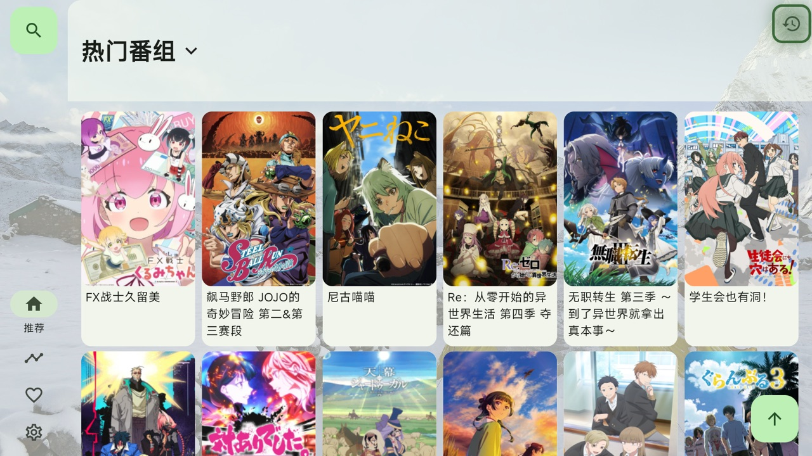
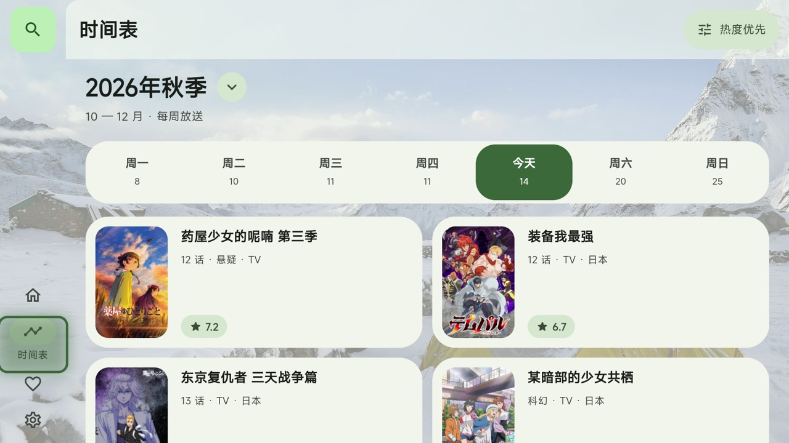
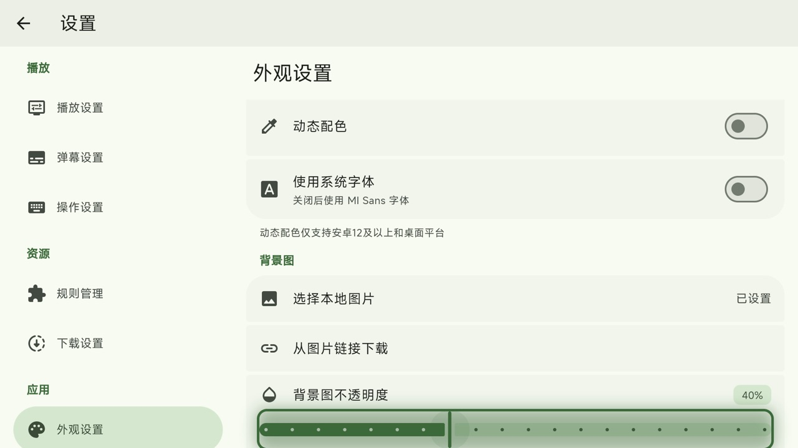

<div align=center>

<h1>Kazumi TV</h1>

</img>

<p>给 <a href="https://github.com/Predidit/Kazumi">Kazumi</a> 加上遥控器操作的电视版，非官方</p>

<a href="https://github.com/LeoLee0812/Kazumi-TV/releases/latest"></img></a>
</img>
</img>
</img>
<a href="LICENSE"></img></a>

</div>



## 这是什么

[Kazumi](https://github.com/Predidit/Kazumi) 是 [Predidit](https://github.com/Predidit) 和社区贡献者开发的番剧采集与在线观看应用，番剧、规则、弹幕、播放器这些能力全部来自原项目。

这个仓库只在它上面做了一件事：让它能装在电视上、用遥控器操作。这里**不是官方版本**，和原项目的维护者没有关系。

- 电视版的问题请提到[这个仓库的 Issues](https://github.com/LeoLee0812/Kazumi-TV/issues)，不要去打扰原项目
- 手机、平板、电脑请直接用[官方版本](https://github.com/Predidit/Kazumi/releases/latest)
- 觉得好用，请去给[原项目](https://github.com/Predidit/Kazumi)点 Star

## 和原版的区别

| 改动 | 说明 |
| --- | --- |
| 电视桌面入口 | 声明 Leanback 启动入口和横幅图标，不要求触摸屏 |
| 遥控器焦点框 | 方向键移动焦点时，在当前控件外画一圈描边 |
| 导航栏可达 | 焦点可以在左侧导航栏和页面内容之间来回，设置页左右两栏同理 |
| 遥控器键位 | 确认键播放暂停，左右键快退快进，上下键音量，频道加减切集 |
| 内置规则 | 把 [KazumiRules](https://github.com/Predidit/KazumiRules) 里维护中的规则打进安装包，装完就能用 |
| 主界面背景图 | 外观设置里可以选一张图做背景，不透明度可调 |





## 安装

到 [Releases](https://github.com/LeoLee0812/Kazumi-TV/releases/latest) 下载安装包，用 U 盘或者 `adb install` 装到电视上。

- 大多数电视和盒子是 32 位系统，选 `armeabi-v7a`
- 较新的 64 位设备选 `arm64-v8a`

安装包的包名和官方版相同、签名不同，两者不能互相覆盖安装。电视上装过官方版的话，需要先卸载。

## 构建

```bash
git clone https://github.com/LeoLee0812/Kazumi-TV.git
cd Kazumi-TV
flutter pub get
flutter build apk --release --split-per-abi
```

Flutter 版本见 `pubspec.yaml`。其余开发说明和原项目一致，参考原项目的[贡献指引](https://github.com/Predidit/Kazumi/blob/main/static/doc/CONTRIBUTING.md)。

## 和原项目的关系

原项目的维护者认为电视端适合作为独立应用单独维护，不合并进主线，所以电视相关的改动都留在这个仓库里。其中和电视无关的通用修复会单独提回原项目。

版本号写作 `原版本号-tv.序号`，例如 `2.3.8-tv.1` 基于原项目的 `2.3.8`。

## 致谢

- [Predidit/Kazumi](https://github.com/Predidit/Kazumi) 以及它的[所有贡献者](https://github.com/Predidit/Kazumi/graphs/contributors)，这个项目的全部功能都建立在他们的工作之上
- [Predidit/KazumiRules](https://github.com/Predidit/KazumiRules) 的规则作者
- 原项目致谢的 [Bangumi](https://bangumi.tv/)、[DandanPlay](https://www.dandanplay.com/)、[media-kit](https://github.com/media-kit/media-kit)、[Anime4K](https://github.com/bloc97/Anime4K) 等项目

## 许可证

和原项目一样，基于 [GNU 通用公共许可证第 3 版（GPL-3.0）](LICENSE) 授权。原项目的版权归其作者和贡献者所有，这个仓库的改动同样以 GPL-3.0 发布。

本应用不提供任何番剧内容，所有内容来自用户自行配置的规则，仅供学习交流。
